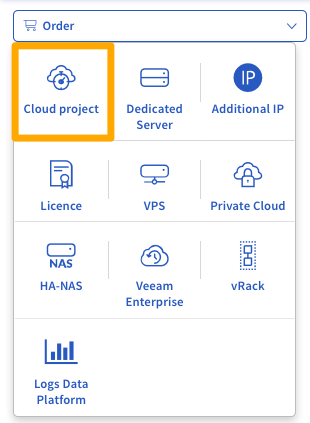
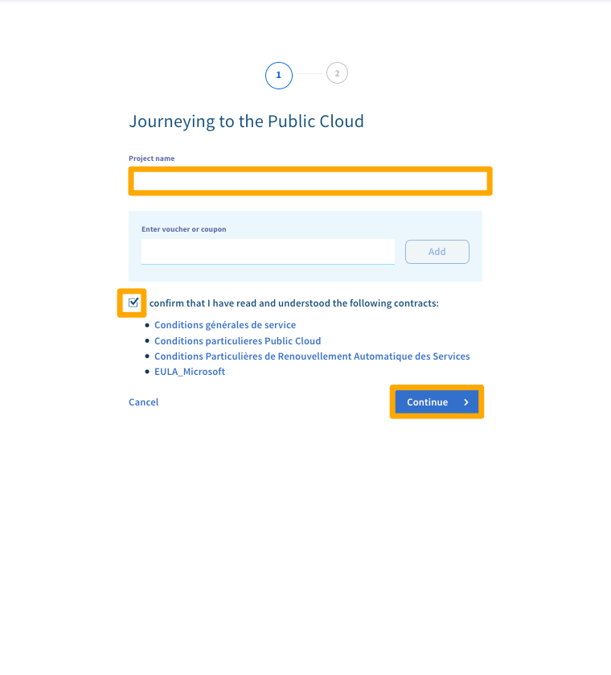
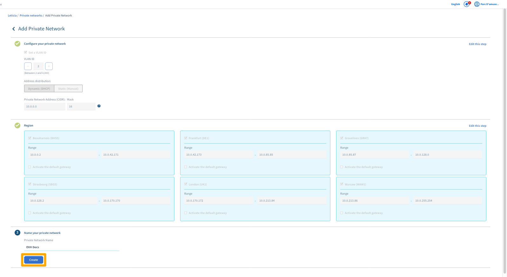

---
title: 'Configuring the vRack between the Public Cloud and a Dedicated Server'
slug: vrack-pci-ds
excerpt: 'This guide will show you how to configure private networking between a Public Cloud instance and a Dedicated Server.'
section: 'Network Management'
e--

**Last updated 18th June 2018**

## Objective

The [vRack](https://www.ovh.com.au/solutions/vrack/){.external} allows you to configure private network addressing between two or more OVHcloud [Dedicated Servers](https://www.ovh.com.au/dedicated_servers/){.external}. But it also allows you to add [Public Cloud instances](https://www.ovh.com.au/public-cloud/instances/){.external} to your private network so that you can create an infrastructure of both physical and virtual resources.

**This guide will show you how to configure private networking between a [Public Cloud instance](https://www.ovh.com.au/public-cloud/instances/){.external} and a [Dedicated Server](https://www.ovh.com.au/dedicated_servers/){.external}.**

## Requirements

* a [vRack](https://www.ovh.com.au/solutions/vrack/){.external} service activated in your account
* a vRack-compatible [Dedicated Server](https://www.ovh.com.au/dedicated_servers/){.external}
* access to your [OVHcloud Control Panel](https://ca.ovh.com/auth/?action=gotomanager){.external}
* your chosen private IP address range

## Instructions

### Create a Public Cloud project

Log in to your [OVHcloud Control Panel](https://ca.ovh.com/auth/?action=gotomanager){.external}.

Click on the `Server`{.action} menu and then click the `Order`{.action} button.

{.thumbnail}

Under the **Order** menu, click on the `Cloud project`{.action} button.

{.thumbnail}

Give your project a name, read and accept the contracts, and then click the `Continue`{.action} button.

{.thumbnail}

Select a payment method and then click `Create my project`{.action}

{.thumbnail}

Once your project is set up, you will need to add it to the vrack. Click on `Server`{.action} and then on `vRack`{.action}

{.thumbnail}

Select your exisitng vRack, then select your Cloud Project, then click on `Add`{.action}

{.thumbnail}

Next,  you need to enable private networks. Click the `Enable private networks`{.action} button on the project page.

{.thumbnail}

Here you can create your networks setup and name the network. Once this is setup to your preference click on `Create` {.action}

{.thumbnail}

### Create a Public Cloud instance

On your project page, click the `Create an instance`{.action} button.

{.thumbnail}

Select your Model, Region, and Image. Then choose your Private Network.

{.thumbnail}

Finally, choose your billing period  and then click the `Create an instance`{.action} button. For detailed information on the various options, please refer to this guide: [Create an instance in your OVHcloud customer account](../public-cloud/create_an_instance_in_your_ovh_customer_account/){.external}.

### Configure your network interfaces

Next, configure the the network interfaces on your new [Public Cloud instance](https://www.ovh.com.au/public-cloud/instances/){.external} and [Dedicated Server](https://www.ovh.com.au/dedicated_servers/){.external} using this guide: [Configuring the vRack on your Dedicated Servers](../configuring-vrack-on-dedicated-servers/){.external}.

## Go further

Join our community of users on <https://community.ovh.com/en/>.
