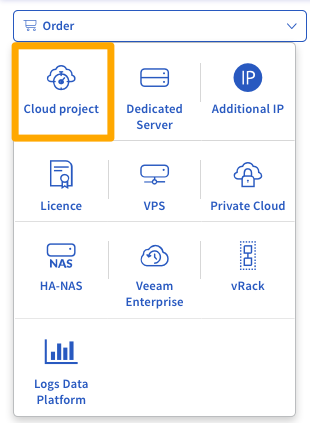
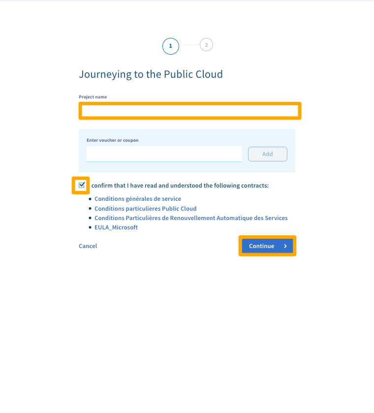
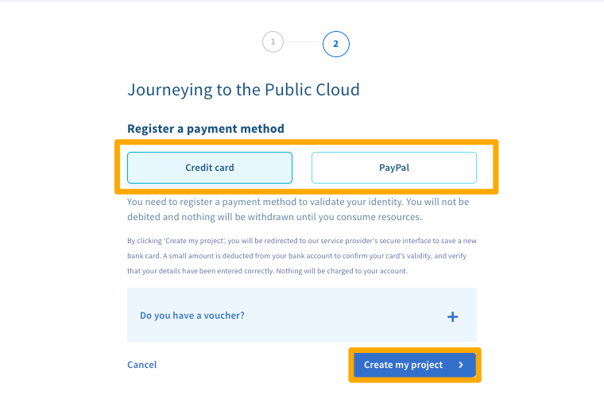
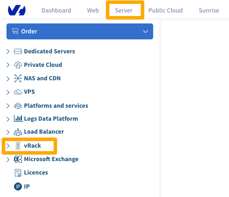
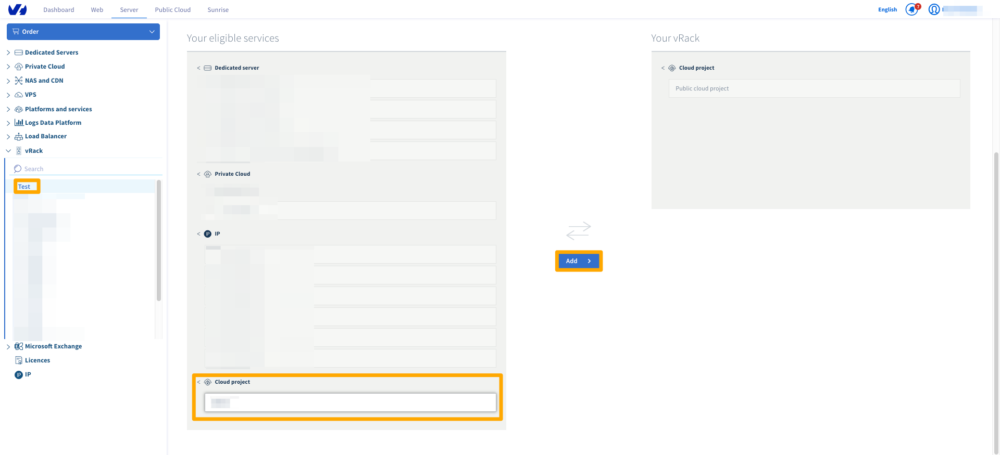
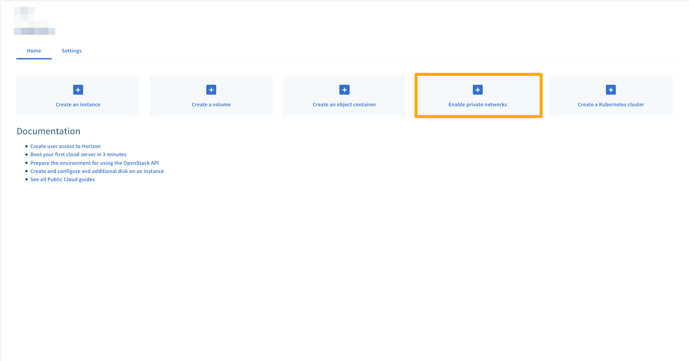
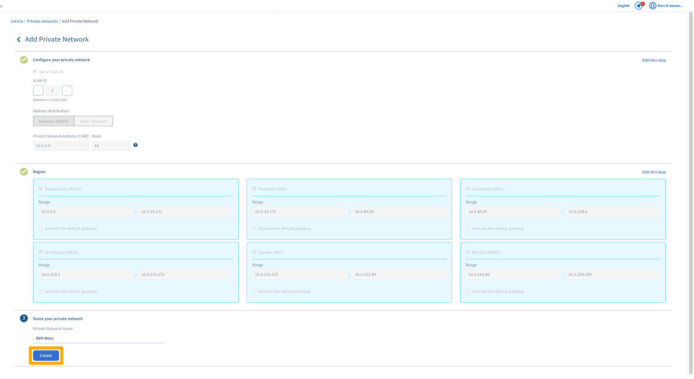
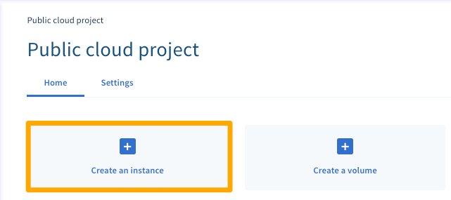
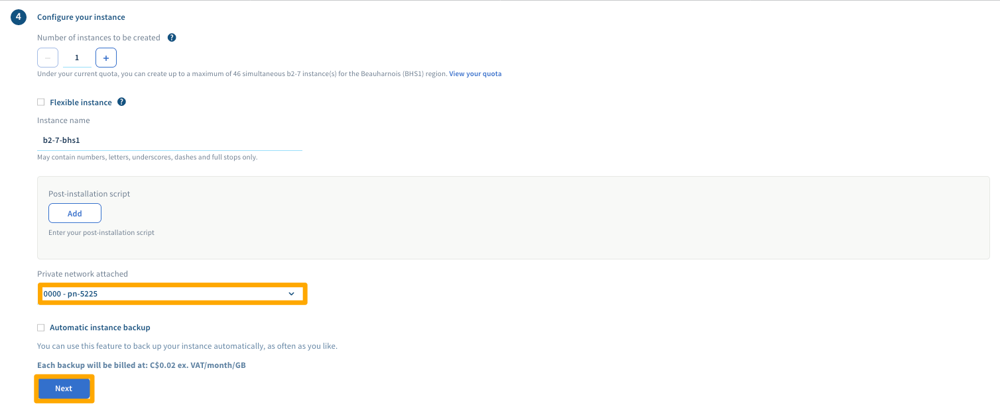

**Last updated 18th June 2018**

## Objective

<<<<<<< HEAD
The [vRack](https://www.ovh.com/ca/en/solutions/vrack/){.external} allows you to configure private network addressing between two or more OVHcloud [Dedicated Servers](https://www.ovh.com/ca/en/dedicated_servers/){.external}. But it also allows you to add [Public Cloud instances](https://www.ovh.com/ca/en/public-cloud/instances/){.external} to your private network so that you can create an infrastructure of both physical and virtual resources.

**This guide will show you how to configure private networking between a [Public Cloud instance](https://www.ovh.com/ca/en/public-cloud/instances/){.external} and a [Dedicated Server](https://www.ovh.com/ca/en/dedicated_servers/){.external}.**
=======
The [vRack](https://www.ovh.co.uk/solutions/vrack/){.external} allows you to configure private network addressing between two or more OVH [Dedicated Servers](https://www.ovh.co.uk/dedicated_servers/){.external}. But it also allows you to add [Public Cloud instances](https://www.ovh.co.uk/public-cloud/instances/){.external} to your private network so that you can create an infrastructure of both physical and virtual resources.

**This guide will show you how to configure private networking between a [Public Cloud instance](https://www.ovh.co.uk/public-cloud/instances/){.external} and a [Dedicated Server](https://www.ovh.co.uk/dedicated_servers/){.external}.**
>>>>>>> upstream/develop

## Requirements

<<<<<<< HEAD
* a [vRack](https://www.ovh.com/ca/en/solutions/vrack/){.external} service activated in your account
* a vRack-compatible [Dedicated Server](https://www.ovh.com/ca/en/dedicated_servers/){.external}
* access to your [OVHcloud Control Panel](https://ca.ovh.com/auth/?action=gotomanager){.external}
=======
* a [vRack](https://www.ovh.co.uk/solutions/vrack/){.external} service activated in your account
* a vRack-compatible [Dedicated Server](https://www.ovh.co.uk/dedicated_servers/){.external}
* access to your [OVH Control Panel](https://www.ovh.com/auth/?action=gotomanager){.external}
>>>>>>> upstream/develop
* your chosen private IP address range

## Instructions

### Create a Public Cloud project

<<<<<<< HEAD
Log in to your [OVHcloud Control Panel](https://ca.ovh.com/auth/?action=gotomanager){.external}.

Click on the `Server`{.action} menu and then click the `Order`{.action} button.

{.thumbnail}

Under the **Order** menu, click on the `Cloud project`{.action} button.

{.thumbnail}

Give your project a name, read and accept the contracts, and then click the `Continue`{.action} button.

{.thumbnail}

Select a payment method and then click `Create my project`{.action}

{.thumbnail}

Once your project is set up, you will need to add it to the vrack. Click on `Server`{.action} and then on `vRack`{.action}

{.thumbnail}

Select your exisitng vRack, then select your Cloud Project, then click on `Add`{.action}

{.thumbnail}

Next,  you need to enable private networks. Click the `Enable private networks`{.action} button on the project page.

{.thumbnail}

Here you can create your networks setup and name the network. Once this is setup to your preference click on `Create` {.action}

{.thumbnail}

### Create a Public Cloud instance

On your project page, click the `Create an instance`{.action} button.

{.thumbnail}

Select your Model, Region, and Image. Then choose your Private Network.

{.thumbnail}

Finally, choose your billing period  and then click the `Create an instance`{.action} button. For detailed information on the various options, please refer to this guide: [Create an instance in your OVHcloud customer account](../public-cloud/create_an_instance_in_your_ovh_customer_account/){.external}.

=======
Log in to your [OVH Control Panel](https://www.ovh.com/auth/?action=gotomanager){.external}.

Click on the `Cloud`{.action} menu and then click the `Order`{.action} button.

{.thumbnail}

Under the **Order** menu, click on the `Cloud project`{.action} button.

{.thumbnail}

Give your project a name, choose a payment method, and then click the `Create the project`{.action} button.

{.thumbnail}

Once your project is set up, you need to enable private networks. Click the `Enable private networks`{.action} button on the project page.

{.thumbnail}

Next, select the `Existing`{.action} option and then choose your existing vRack from the dropdown list.

{.thumbnail}

### Create a Public Cloud instance

On your project page, click the `Actions`{.action} button.

{.thumbnail}

From the dropdown list, click the `Add a server`{.action} option.

{.thumbnail}

Click the `Advanced options`{.action} button.

{.thumbnail}

Next, click the dropdown list under **Link to the private network:** and select your vRack. Then click `Continue`{.action} to return to the previous screen.

{.thumbnail}

Finally, choose your installation options and then click the `Launch now`{.action} button. For detailed information on the various options, please refer to this guide: [Create an instance in your OVH customer account](https://docs.ovh.com/gb/en/public-cloud/create_an_instance_in_your_ovh_customer_account/){.external}.

{.thumbnail}
>>>>>>> upstream/develop

### Configure your network interfaces

<<<<<<< HEAD
Next, configure the the network interfaces on your new [Public Cloud instance](https://www.ovh.com/ca/en/public-cloud/instances/){.external} and [Dedicated Server](https://www.ovh.com/ca/en/dedicated_servers/){.external} using this guide: [Configuring the vRack on your Dedicated Servers](../configuring-vrack-on-dedicated-servers/){.external}.
=======
Next, configure the the network interfaces on your new [Public Cloud instance](https://www.ovh.co.uk/public-cloud/instances/){.external} and [Dedicated Server](https://www.ovh.co.uk/dedicated_servers/){.external} using this guide: [Configuring the vRack on your Dedicated Servers](https://docs.ovh.com/gb/en/dedicated/configuring-vrack-on-dedicated-servers/){.external}.
>>>>>>> upstream/develop

## Go further

<<<<<<< HEAD
Join our community of users on <https://community.ovh.com/en/>.
=======
Join our community of users on <https://community.ovh.com/en/>.
>>>>>>> upstream/develop
