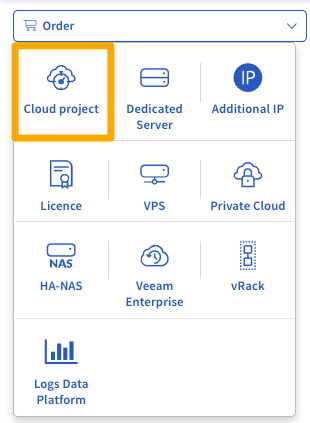
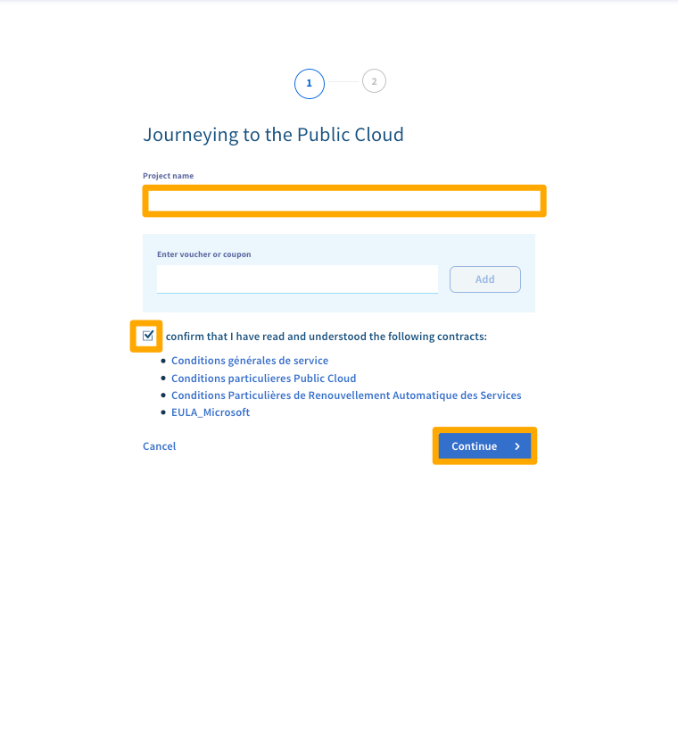
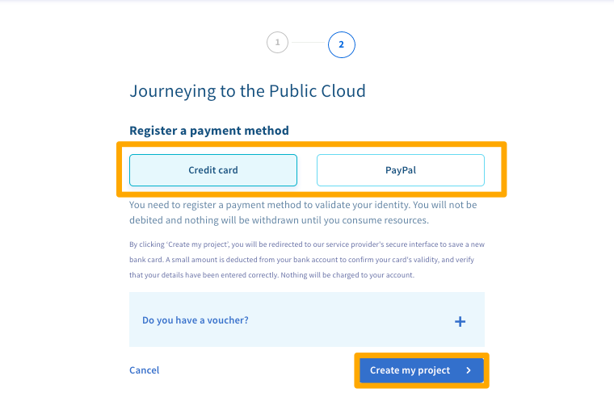
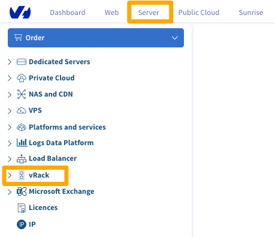
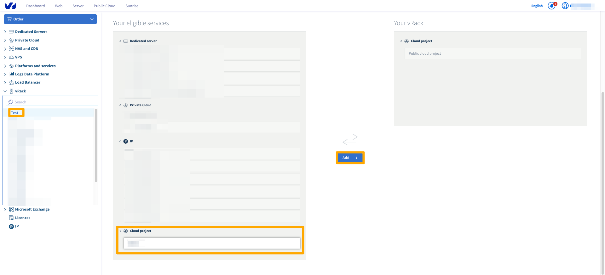
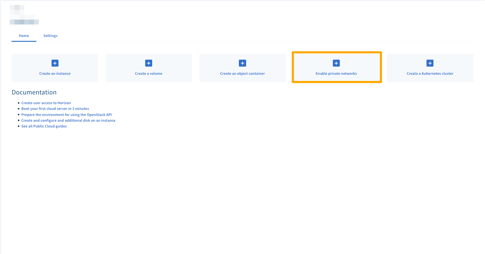
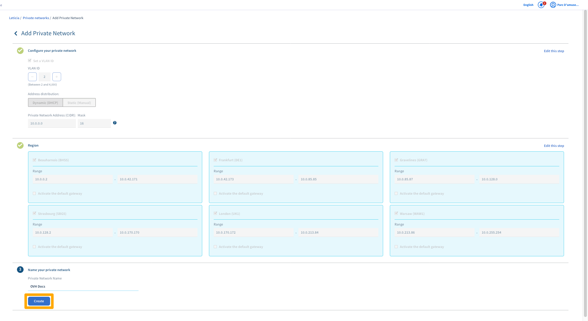
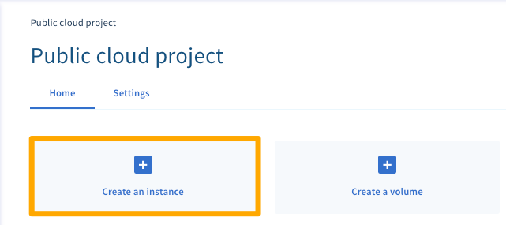
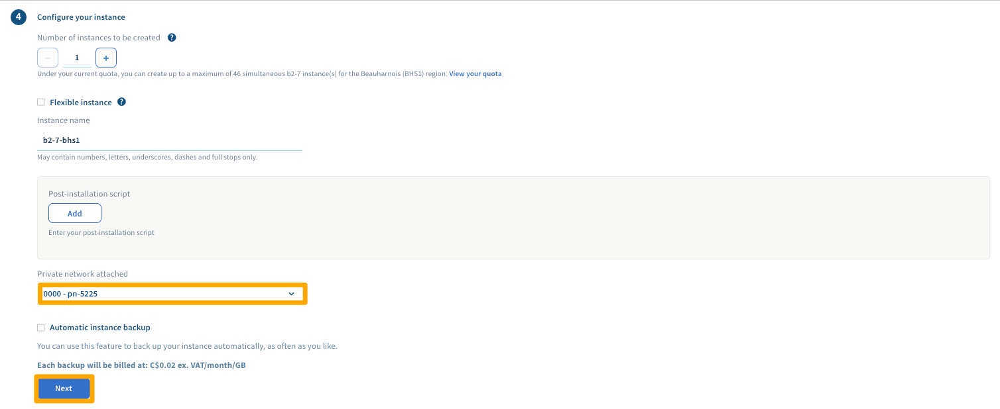

**Dernière mise à jour le 27/07/2018**

## Objectif

<<<<<<< HEAD
Le [vRack](https://www.ovh.com/ca/fr/solutions/vrack/){.external} est un réseau privé qui vous permet de configurer l'adressage entre deux ou plusieurs [serveurs dédiés](https://www.ovh.com/ca/fr/serveurs_dedies/){.external} OVH. Mais il vous permet également d'ajouter des [instances Public Cloud](https://www.ovh.com/ca/fr/public-cloud/instances/){.external} à votre réseau privé afin de créer une infrastructure de ressources physiques et virtuelles.
=======
Le [vRack](https://www.ovh.com/fr/solutions/vrack/){.external} est un réseau privé qui vous permet de configurer l'adressage entre deux ou plusieurs [serveurs dédiés](https://www.ovh.com/fr/serveurs_dedies/){.external} OVH. Mais il vous permet également d'ajouter des [instances Public Cloud](https://www.ovh.com/fr/public-cloud/instances/){.external} à votre réseau privé afin de créer une infrastructure de ressources physiques et virtuelles.
>>>>>>> upstream/develop

**Ce guide vous montre comment configurer le réseau privé entre une instance Public Cloud et un serveur dédié.**

## Prérequis

<<<<<<< HEAD
- Avoir activé un service [vRack](https://www.ovh.com/ca/fr/solutions/vrack){.external}.
- Posséder un [serveur dédié](https://www.ovh.com/ca/fr/serveurs_dedies/){.external} compatible avec le vRack.
- Être connecté à l'[espace client OVHcloud](https://ca.ovh.com/auth/?action=gotomanager){.external}.
=======
- Avoir activé un service [vRack](https://www.ovh.com/fr/solutions/vrack){.external}.
- Posséder un [serveur dédié](https://www.ovh.com/fr/serveurs_dedies/){.external} compatible avec le vRack.
- Être connecté à l'[espace client OVH](https://www.ovh.com/auth/?action=gotomanager){.external}.
>>>>>>> upstream/develop
- Avoir accès à votre plage d'adresses IP privées choisie.

## En pratique

### Créer un projet Public Cloud

<<<<<<< HEAD
Une fois connecté dans l'[espace client OVHcloud](https://ca.ovh.com/auth/?action=gotomanager){.external}, cliquez sur le menu `Server`{.action}, puis sur le bouton `Commander`{.action}.

{.thumbnail}

Sous le menu `Commander`, cliquez sur le bouton `Projet cloud`{.action}.

{.thumbnail}

Donnez un nom à votre projet, lire et accepter les contrats, puis cliquez sur le bouton `Continuer`{.action}.

{.thumbnail}

Sélectionnez un mode de paiement, puis cliquez sur `Créer mon projet`{.action}

{.thumbnail}

Une fois votre projet configuré, vous devrez l'ajouter au vRack. Cliquez sur "Serveur"{.action}, puis sur "vRack"{.action}

{.thumbnail}

Sélectionnez votre vRack existant, puis sélectionnez votre projet cloud, puis cliquez sur "Ajouter"{.action}

{.thumbnail}

Ensuite, vous devez activer les réseaux privés. Cliquez sur le bouton "Activer les réseaux privés"{.action} de la page du projet.

{.thumbnail}

Vous pouvez ici créer la configuration de vos réseaux et nommer le réseau. Une fois que cela a été configuré à votre préférence, cliquez sur "Create" {.action}

{.thumbnail}

### Créer une instance Public Cloud

Sur la page de votre projet, cliquez sur le bouton `Créer une instance`{.action}.

{.thumbnail}

Sélectionnez votre modèle, région et image. Choisissez ensuite votre réseau privé.

{.thumbnail}

Enfin, choisissez votre période de facturation, puis cliquez sur le bouton "Créer une instance"{.action}. Pour plus d'informations sur les différentes options, veuillez vous reporter au présent guide : [Créez une instance dans votre compte client OVHcloud](../public-cloud/create_an_instance_in_your_ovh_customer_account/){.external}.
=======
Une fois connecté dans l'[espace client OVH](https://www.ovh.com/auth/?action=gotomanager){.external}, cliquez sur le menu `Cloud`{.action}, puis sur le bouton `Commander`{.action}.

{.thumbnail}

Sous le menu `Commander`, cliquez sur le bouton `Projet cloud`{.action}.

{.thumbnail}

Donnez un nom à votre projet, choisissez un mode de paiement, puis cliquez sur le bouton `Créer le projet`{.action}.

{.thumbnail}

Une fois votre projet configuré, vous devez activer les réseaux privés. Cliquez sur le bouton `Activer les réseaux privés`{.action} sur la page du projet.

{.thumbnail}

Ensuite, sélectionnez l'option `Existant`{.action}, puis choisissez votre vRack dans la liste déroulante.

{.thumbnail}

### Créer une instance Public Cloud

Sur la page de votre projet, cliquez sur le bouton `Actions`{.action}.

{.thumbnail}

Dans la liste déroulante, cliquez sur l'option `Ajouter un serveur`{.action}.

{.thumbnail}

Cliquez sur le bouton `Options avancées`{.action}.

{.thumbnail}

Ensuite, cliquez sur la liste déroulante sous « **Lien vers le réseau privé :** » et sélectionnez votre vRack. Cliquez alors sur `Continuer`{.action} pour revenir à l’écran précédent.

{.thumbnail}

Pour finir, choisissez vos options d’installation puis cliquez sur le bouton `Lancer maintenant`{.action}.

{.thumbnail}
>>>>>>> upstream/develop

### Configurer vos interfaces réseau

<<<<<<< HEAD
Pour configurer les interfaces réseau entre l'instance Public Cloud nouvellement créée et votre serveur dédié, vous pouvez vous référer directement au guide sur notre guide intitulé « [Configurer plusieurs serveurs dédiés dans le vRack](../configurer-plusieurs-serveurs-dedies-dans-le-vrack/){.external} ».
=======
Pour configurer les interfaces réseau entre l'instance Public Cloud nouvellement créée et votre serveur dédié, vous pouvez vous référer directement au guide sur notre guide intitulé « [Configurer plusieurs serveurs dédiés dans le vRack](https://docs.ovh.com/fr/dedicated/configurer-plusieurs-serveurs-dedies-dans-le-vrack/){.external} ».
>>>>>>> upstream/develop

## Aller plus loin

<<<<<<< HEAD
Échangez avec notre communauté d'utilisateurs sur <https://community.ovh.com/>.
=======
Échangez avec notre communauté d'utilisateurs sur <https://community.ovh.com/>.
>>>>>>> upstream/develop
