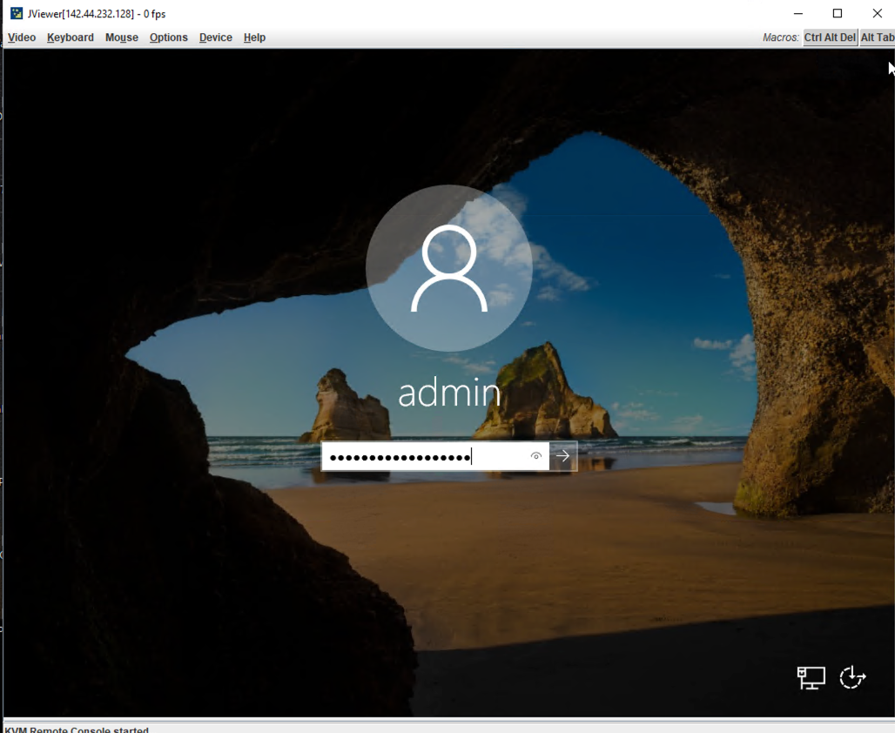
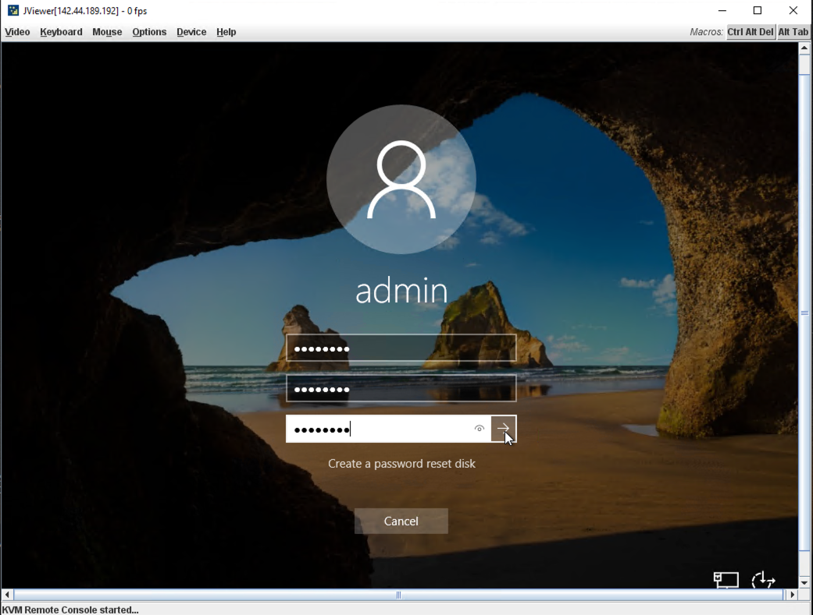
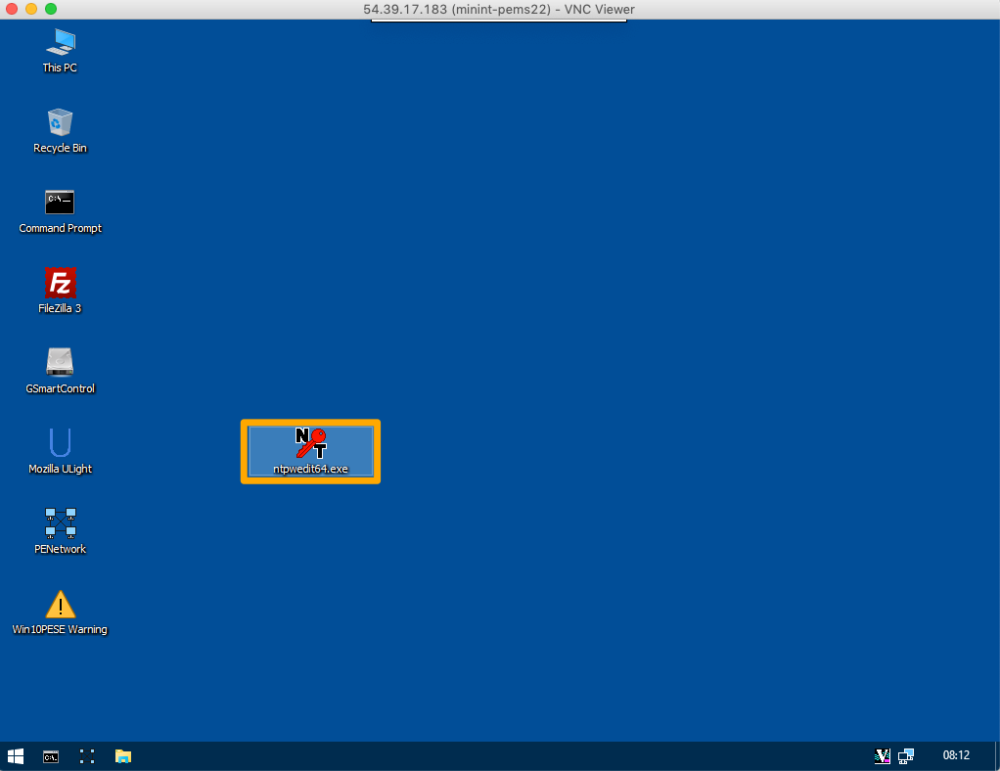

**Dernière mise à jour le 30/08/2018**

## Objectif

Lorsque vous installez ou réinstallez un système d'exploitation Windows, tous les comptes ont une date d'expiration par défaut de 42 jours. Lorsqu'un mot de passe est expiré, l'accès RDP à ce compte est désactivé. Vous devrez modifier le mot de passe pour pouvoir y accéder.

**Ce guide vous explique comment réinitialiser le mot de passe.**

## Prérequis

* Posséder un [serveur dédié](https://www.ovh.com/fr/serveurs_dedies/){.external} avec Windows installé.
* Être connecté à l'[espace client OVH](https://www.ovh.com/auth/?action=gotomanager){.external}.

## En pratique

### Utilisation de l'IPMI

Pour commencer, connectez-vous à la page de votre serveur dans votre [espace client OVHcloud](https://ca.ovh.com/auth/?action=gotomanager){.external}. Ensuite, sélectionnez l'onglet "IPMI"{.action}.

> [!primary]
>
> Pour des informations détaillées sur l'utilisation de la fonction IPMI, veuillez vous reporter à notre [guide relatif à l'utilisation de l'IPMI](https://docs.ovh.com/fr/dedicated/utilisation-ipmi-serveurs-dedies/){.external}.
>

Activez la fonction IPMI à l'aide de l'applet Java ou de votre navigateur. Après le démarrage de la session IPMI, connectez-vous à votre compte d'administration avec vos informations d'identification actuelles.

{.thumbnail}

Vous devriez maintenant recevoir un message indiquant que "Votre mot de passe a expiré et doit être modifié. Cliquez sur "OK"{.action}.

{.thumbnail}

Entrez maintenant un nouveau mot de passe et confirmez-le avec les champs fournis.

{.thumbnail}

Votre mot de passe a été modifié. Vous pouvez à nouveau accéder au serveur à l'aide de RDP.

### Utilisation du mode rescue

Pour démarrer, démarrez votre serveur en [mode rescue](https://docs.ovh.com/ca/en/dedicated/rescue-mode/){.external} en utilisant  l'environnement d'initialisation WinRescue. Une fois le serveur redémarré, connectez-vous à l'aide d'une visionneuse VNC ou sélectionnez l'onglet "IPMI"{.action} sur la page de votre serveur dans votre [espace client OVHcloud](https://ca.ovh.com/auth/?action=gotomanager){.external}.

Ensuite, ouvrez l'outil NTPWdi. S'il n'y apparaît pas, vous pouvez télécharger une copie [ici](http://cdslow.org.ru/files/ntpwedit/ntpwed07.zip){.external}

{.thumbnail}

Cliquez ensuite sur le bouton "Open"{.action} pour afficher la liste des comptes d'utilisateurs disponibles.

{.thumbnail}

Enfin, cliquez sur le bouton "Unlockr"{.action}.

{.thumbnail}

Votre mot de passe a été modifié. Quittez l'outil, fermez la session et redémarrez votre serveur en mode normal.

## Aller plus loinr

[Mode Rescue](https://docs.ovh.com/fr/dedicated/ovh-rescue/){.external}.

[L’utilisation de l’IPMI pour les serveurs dédiés](https://docs.ovh.com/fr/dedicated/utilisation-ipmi-serveurs-dedies/){.external}.

Échangez avec notre communauté d'utilisateurs sur <https://community.ovh.com/>.
