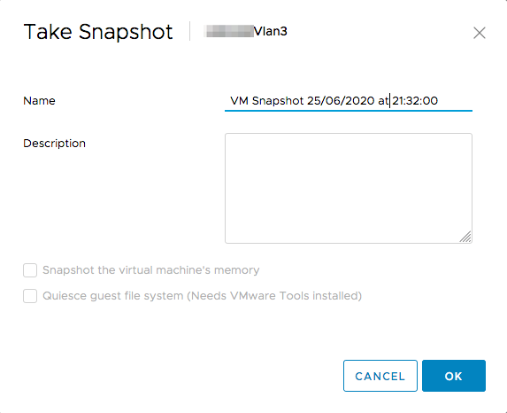

**Dernière mise à jour le 25/06/2020**

## Objectif 

Vous pouvez prendre un snapshot d'une machine virtuelle. Une fois que vous avez pris le snapshot, vous pouvez restaurer toutes les machines virtuelles sur le snapshot le plus récent ou supprimer le snapshot.

**Ce guide explique le fonctionnement des snapshots.**

## Prérequis

- Posséder un produit [Private Cloud](https://www.ovhcloud.com/fr/enterprise/products/hosted-private-cloud/){.external}.
- Être connecté au client vSphere HTML

## En pratique

Les snapshots sont utiles quand vous devez retourner à plusieurs reprises au même état, sans créer de multiples machines virtuelles. Avec les snapshots, vous créez des positions de restauration. 

Vous pouvez ainsi préserver l’état de base d’une VM avant de la faire migrer vers un autre type de fonctionnement. 

Bien que les snapshots fournissent une image « instantanée » du disque, utilisables par les solutions de sauvegarde (Veeam, Nakivo), l'effacement régulier des snapshots présents est conseillé. En effet, si vous avez un grand nombre de snapshots, ceux-ci mobiliseront beaucoup d’espace-disque et pénalisent la VM en terme de performances.

> [!primary]
> 
> Il est déconseillé d’employer les snapshots comme méthode de sauvegardes de machine virtuelle.
> 

Le snapshot vous permet de capturer l’état de votre VM au moment ou vous le lancez. Ce snapshot comprend (selon vos choix) :

- L’état de tous les disques de la machine virtuelle.
- Le contenu de la mémoire de la machine virtuelle.

> [!warning]
> 
> Il n'est pas possible de modifier la taille d'un disque lorsqu'un snapshot est pris sur une VM.
> 

### Prise du snapshot

Faites un clic droit sur votre VM puis choisissez `Snapshots`{.action} et enfin `Prendre un snapshot...`{.action} :

{.thumbnail}

Vous devez maintenant indiquer le nom que vous voulez attribuer à ce snapshot, sa description, et si vous souhaitez que la mémoire de la VM soit également incluse dans le snapshot.

Vous avez ici la possibilité de faire un snapshot avec ou sans la RAM utilisée par la VM. Si vous intégrez la RAM au snapshot, cela allongera le temps d’exécution de la tâche, mais cela vous permettra de ne pas avoir à faire de reboot lors de la restauration de celui-ci. 

Dans le cas contraire, puisque la RAM n’est pas sauvegardée, la tâche sera plus rapide, mais un reboot de la VM sera nécessaire en cas de restauration.

{.thumbnail}

### Gestion des snapshots

Vous pouvez retrouver l’ensemble des snapshots d’une VM dans le gestionnaire des snapshots. Pour cela, faites un clic droit sur la VM puis choisissez `Snapshot`{.action} et enfin `Gérer les snapshots`{.action} :

{.thumbnail}

### Supprimer un snapshot

Dans le gestionnaire des snapshots, sélectionnez le snapshot à supprimer et cliquez sur `Supprimer`{.action}.

Il est possible de supprimer tous les snapshots de la VM en une seule opération en cliquant sur `Supprimer tout`{.action}.

### Restaurer un snapshot

Dans le gestionnaire des snapshots, sélectionnez le snapshot à restaurer et cliquez sur `Restaurer`{.action}

## Aller plus loin

Échangez avec notre communauté d'utilisateurs sur <https://community.ovh.com>.
