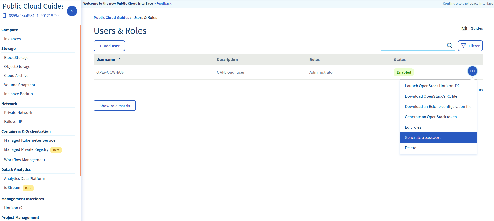
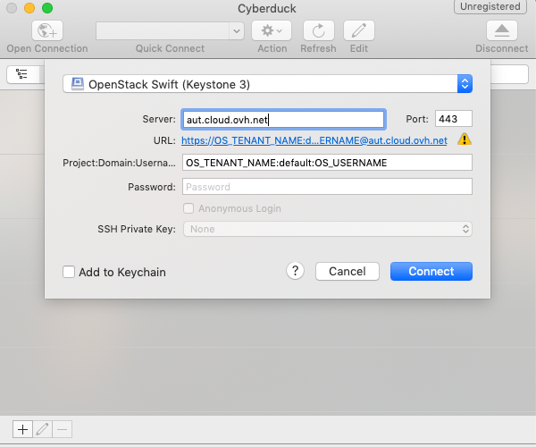

## Preamble
Object Storage is a storage solution that is managed primarily through the OpenStack API. However, you might not be familiar with managing storage space via command line.

There are graphical interface solutions that seamlessly make use the OpenStack APIs. Cyberduck is a Swift client.

Other interfaces can be found on the Internet and configuration is similar to the configuration explained in this guide.

This guide will explain how to configure Cyberduck to manage your Object Storage using a GUI based on Openstack APIs.

### Requirements
<<<<<<< HEAD
- A configured Horizon user :  view [guide](../platform/public-cloud/access_console_of_horizon_instance/guide.en-ca.md){.ref}
- The Tenant ID of your project and your user ID, viewable in the downloadable OpenRC file.
- The password of your user.
=======
- A configured Horizon user :  view [guide](https://www.ovh.co.uk/g1773.configure_user_access_to_horizon/){.external}
- The ID of your project and your user, viewable in the menu Access & Security in Horizon downloading OpenRC file.
>>>>>>> 348b217a62abc0edf96abf42a4ea375f38eca1ce

{.thumbnail}

## Configuration of Cyberduck
- Download [Cyberduck](https://cyberduck.io/){.external}
- Connect to an account type  "Swift - OpenStack Object Storage"

<<<<<<< HEAD
{.thumbnail}
=======
{.thumbnail}
>>>>>>> 348b217a62abc0edf96abf42a4ea375f38eca1ce

You need to provide some information in the form :

- Server : auth.cloud.ovh.net (Authentification Server)
<<<<<<< HEAD
- Project:Domain:Username : OS_TENANT_NAME:default:OS_USERNAME
- Password : Password of your Horizon_User
=======
- Tenant ID:Access Key : correspond to ID_of_Project : ID_Horizon_User
- Secret Key : Password of your Horizon_User
- More Options / Path : v2.0
>>>>>>> 348b217a62abc0edf96abf42a4ea375f38eca1ce
- Connect

{.thumbnail}