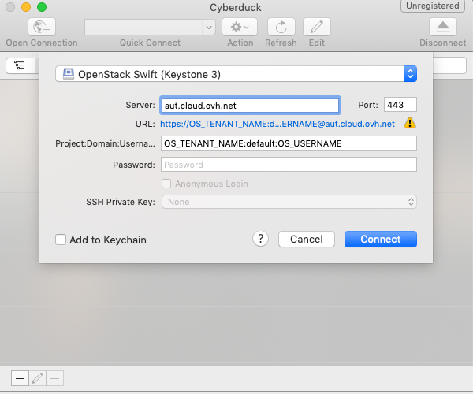

**Last updated O8th January 2020**

## 
Object Storage is a storage solution that is managed primarily through the OpenStack API.

If you're not familiar with managing storage through command lines, there are some graphics solutions that use the OpenStack API for you. CyberDuck is one of these solutions and it is easy to configure. 

This guide will explain how to configure Cyberduck to manage your Object Storage using a graphical interface based on the Openstack APIs.

## Prerequisites

<<<<<<< HEAD
- You must have access to Horizon:[Accessing the Horizon interface](../platform/public-cloud/access_console_of_horizon_instance/guide.en-ca.md){.ref}
- You must have your project and user ID, which you can get by downloading the OpenRC file in the [Access and Security](../platform/public-cloud/access_and_security_in_horizon/guide.en-ca.md){.ref} menu in Horizon.
=======
- You must have access to Horizon: 
- You must have your project and user ID, which you can get by downloading the OpenRC file in the [Access and Security]({legacy}1774) menu in Horizon.
>>>>>>> 348b217a62abc0edf96abf42a4ea375f38eca1ce

## 

- Download [Cyberduck](https://cyberduck.io/)
- Log in to a "Swift - OpenStack Object Storage" account

<<<<<<< HEAD
{.thumbnail}
=======
{.thumbnail}
>>>>>>> 348b217a62abc0edf96abf42a4ea375f38eca1ce

Enter the following information:

- Server: auth.cloud.ovh.net (Authentication server)
<<<<<<< HEAD
- Project:Domain:Username : OS_TENANT_NAME:default:OS_USERNAME
- Secret Key: your Horizon user password
=======
- Tenant ID:Access Key : This is the Project_ID:Horizon_User_ID
- Secret Key: your Horizon user password
- More Options/Path: v3.0
>>>>>>> 348b217a62abc0edf96abf42a4ea375f38eca1ce

- Log in

{.thumbnail}

<<<<<<< HEAD
##

- [Getting started with the Swift API](../platform/public-cloud/access_console_of_horizon_instance/guide.en-ca.md){.ref}

## 

=======
## 

- [Getting started with the Swift API]({legacy}1916)
- [Configure ownCloud with Object Storage]({legacy}2000)

## 
 

>>>>>>> 348b217a62abc0edf96abf42a4ea375f38eca1ce
