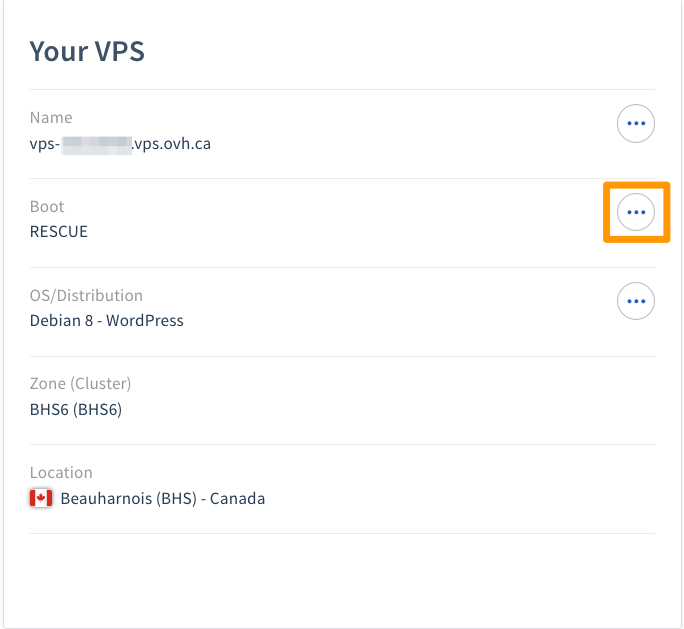

**Dernière mise à jour le 2020/07/20**

## Objectif

En mode rescue, vous pouvez redémarrer votre serveur sur une configuration OVHcloud indépendante. Votre disque peut ensuite être monté comme une partition indépendante.

L'avantage est que vous pouvez effectuer des tests et faire certaines modifications sur la configuration de votre système quand cela vous convient le mieux et quand cela aura le moins d'impact sur vos opérations. Cela vous permet également de corriger les erreurs de configuration qui vous empêche d'accéder au serveur.

Via le mode rescue, vous pouvez :

  - changer votre mot de passe root ;
  - diagnostiquer des problèmes réseau ;
  - réparer un système d'exploitation défectueux ;
  - corriger une mauvaise configuration du pare-feu logiciel ;
  - tester les performances du disque.

Effectuer des vérifications en mode rescue vous aide également à déterminer si un problème est lié au logiciel ou au matériel.

> [!warning]
>
> Si vous avez des services en production sur votre VPS, le mode rescue les interrompt tant que la machine n’a pas été redémarrée en mode normal.
> 

**Ce guide vous explique comment redémarrer votre VPS en mode rescue.**

## Prérequis

- Être connecté à votre [espace client OVH](https://ca.ovh.com/auth/?action=gotomanager){.external}.

## En pratique

Dans votre espace client OVH, cliquez sur l'onglet Server et choisissez votre VPS dans la colonne de gauche.

{.thumbnail}

Sur l'écran principal de votre VPS, sous votre VPS, cliquez sur le bouton boot `···`{.action} et choisissez `Redémarrer en mode rescue`{.action}.

{.thumbnail}

Le redémarrage peut prendre plusieurs minutes.

> [!primary]
>
> À l’issue de cette étape, vous recevez automatiquement un e-mail avec les identifiants SSH du mode rescue. Ce message est également disponible dans votre espace client, section `E-mails de service`{.action}.
> 
{.thumbnail}

Vous pouvez désormais vous connecter au mode rescue de votre VPS en SSH. Pour revenir au mode normal, redémarrez le serveur en cliquant sur le bouton boot `···`{.action} et choisissez `Redémarrer mon VPS`{.action}.

## Aller plus loin

[« Introduction au SSH. »](https://docs.ovh.com/fr/dedicated/ssh-introduction/)

Échangez avec notre communauté d'utilisateurs sur <https://community.ovh.com>.
