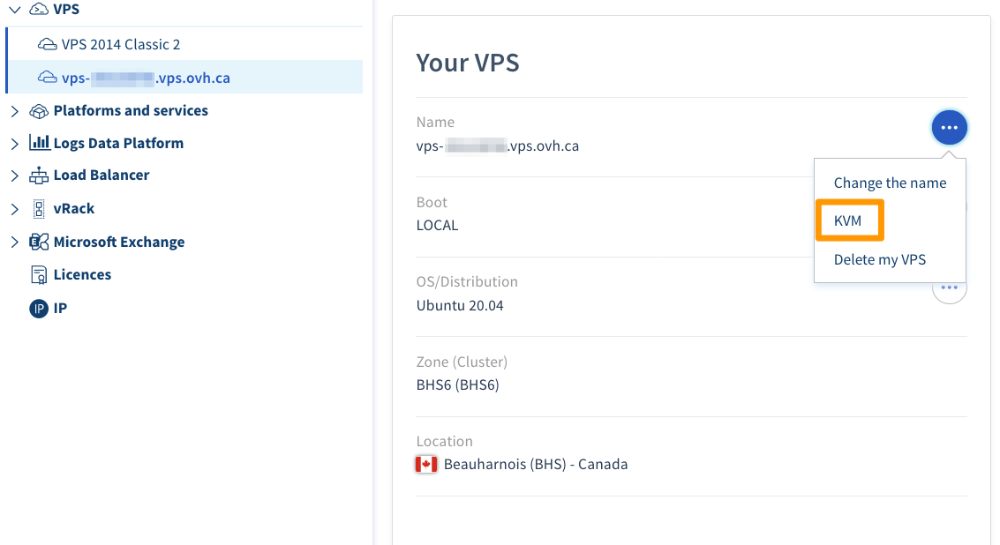

**Last updated 2020/07/17**

## Objective

The KVM console allows you to connect directly to your VPS without the need to use external software such as Terminal or Putty. This console is accessible via your Control Panel or the APIs.  

**This guide explains both of these access methods.**

## Requirements

- You must be logged in to your [Control Panel](https://ca.ovh.com/auth/?action=gotomanager).

## Instructions

### Connecting to the KVM via the Control Panel

Once you have logged in to your Control Panel, click to the Server tab, then in the left-hand column choose your VPS. Click on `···`{.action} button beside your VPS name and you will see `KVM`{.action}:

{.thumbnail}

 
A window will then initiate the connection to your VPS. This could take a few seconds. Then all you have to do is connect:

{.thumbnail}

> [!primary]
>
> The keyboard may have a different layout to your own. Be sure to check it, since the keyboard could be AZERTY instead of QWERTY, for example.
>

### Connecting to the KVM via the APIs

You may sometimes experience issues connecting to the KVM via your Control Panel. In this case, you can use the API solution. First, log in via [OVHcloud API](https://api.ovh.com/).

> [!api]
>
> @api {POST} /vps/{serviceName}/getConsoleUrl
>

## Go further

Join our community of users on <https://community.ovh.com/en/>.
