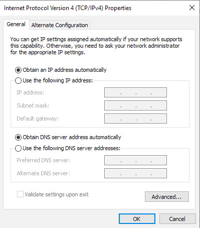

## Objective

The necessary migration of the VPS 2014 services involves moving them to another infrastructure (Private Cloud to Public Cloud). The network configuration between these two infrastructures is different. To successfully migrate the service while keeping up access to your VPS, the migration robot takes action on its network configuration to enable DHCP on IPv4 (only possible on OS based on Ubuntu / Debian / CentOS). For other operating systems, we suggest that you enable the DHCP configuration of your VPS by yourself, before or after the migration.

## Configuring DHCP on a Windows server

Open the Windows Control Panel and click on `Network and Sharing Center`{.action}.

{.thumbnail}

Next, click `Change adapter settings`{.action} in the left-hand menu.

{.thumbnail}

Right-click on your network interface and select `Properties`{.action}.

{.thumbnail}

Select "Internet Protocol Version 4 (TCP / IPv4)" to highlight it, and then click the `Properties`{.action} button.

{.thumbnail}

In this new window, tick the “Obtain an IP address automatically” box. Click the `OK`{.action} button to validate your changes.

{.thumbnail}


## Reconfiguring static IP addresses on a VPS

After the migration is finished, you can restore your static IP address and IP failover configuration. You can find a backup of your old configuration files here:

- Debian/Ubuntu : /etc/network/interfaces.bkp

- CentOS : /etc/sysconfig/ifcfg-eth0.bkp

The following instructions provide some details on how to set up a static IP address on your VPS.

### Using Linux

#### Configure a static IP with CentOS

##### Configuring the network interface

> [!primary]
>
For example purposes, we are using the following variables:
>
Network interface = eth0
>
Static IP address = ip_v4_address
>
Broadcast IP address = ip_v4_broadcast
>
Subnet mask = ip_v4_netmask
>
Default gateway = default_gateway
>

First, connect to your instance via the command line and retrieve your current DHCP configuration:

```
ifconfig eth0
eth0 Link encap:Ethernet HWaddr fa:16:3e:f5:27:38
inet addr:ip_v4_address Bcast:ip_v4_broadcast Mask:ip_v4_netmask
inet6 addr: ip_v6_address/64 Scope:Link
UP BROADCAST RUNNING MULTICAST MTU:1500 Metric:1
RX packets:14261025 errors:0 dropped:0 overruns:0 frame:0
TX packets:12298444 errors:0 dropped:0 overruns:0 carrier:0
collisions:0 txqueuelen:1000
RX bytes:1468155083 (1.3 GiB) TX bytes:1841518946 (1.7 GiB)
netstat -r
Kernel IP routing table
Destination Gateway Genmask Flags MSS Window irtt Iface
default default_gateway 0.0.0.0 UG 0 0 0 eth0
default_gateway * 255.255.255.255 UH 0 0 0 eth0
```

Open the network configuration file:

```
vi /etc/sysconfig/network-scripts/ifcfg-eth0
```

Next, edit the network configuration file by adding these lines:

```
DEVICE="eth0"
BOOTPROTO=static
IPADDR="your_ip_address"
NETMASK="255.255.255.255"
BROADCAST="your_ip_address"
ONBOOT=yes
```

##### Restarting the network service

Finally, restart the network service with the following command:

```
ifup eth0
```

##### Your system starts on the dracut rescue shell

Restart your VPS with rescue mode.

Once the VPS has booted in rescue mode, connect to it via SSH and mount your disk in the /mnt folder:

```
mount /dev/sdb1 /mnt
```

Change the root directory of rescue:

```
chroot /mnt
```

List the available kernels:

```
awk -F\' '$1=="menuentry " {print i++ " : " $2}' /etc/grub2.cfg
0 : CentOS Linux (3.10.0-862.6.3.el7.x86_64) 7 (Core)
1 : CentOS 7, OVH kernel x.xx.xx-xxxx-std-ipv6-64-vps
2 : CentOS Linux (3.10.0-514.26.2.el7.x86_64) 7 (Core)
```

The kernel we are interested in is the OVHcloud kernel (in which the VirtIO SCSI drivers are compiled and enabled by default):

*CentOS 7, OVH kernel x.xx.xx-xxxx-std-ipv6-64-vps*

List the default configuration for grub2: 

```
grub2-editenv list
saved_entry=CentOS Linux (3.10.0-514.26.2.el7.x86_64) 7 (Core)
```

In the next step, modify the configuration so that the OVHcloud kernel becomes the default kernel (to be adapted according to the return of the kernel list):

```
grub2-set-default 1
grub2-editenv list
saved_entry=1
```

Finally, restart your VPS.


#### Configure a static IP address with Debian

##### Configuring the network interface

> [!primary]
>
For example purposes, we are using the following variables:
>
Network interface = eth0
>
Static IP address = ip_v4_address
>
Broadcast IP address = ip_v4_broadcast
>
Subnet mask = ip_v4_netmask
>
Default gateway = default_gateway
>

First, connect to your instance via the command line and retrieve your current DHCP configuration:

```
ifconfig eth0
eth0 Link encap:Ethernet HWaddr fa:16:3e:f5:27:38
inet addr:ip_v4_address Bcast:ip_v4_broadcast Mask:ip_v4_netmask
inet6 addr: ip_v6_address/64 Scope:Link
UP BROADCAST RUNNING MULTICAST MTU:1500 Metric:1
RX packets:14261025 errors:0 dropped:0 overruns:0 frame:0
TX packets:12298444 errors:0 dropped:0 overruns:0 carrier:0
collisions:0 txqueuelen:1000
RX bytes:1468155083 (1.3 GiB) TX bytes:1841518946 (1.7 GiB)
netstat -r
Kernel IP routing table
Destination Gateway Genmask Flags MSS Window irtt Iface
default default_gateway 0.0.0.0 UG 0 0 0 eth0
default_gateway * 255.255.255.255 UH 0 0 0 eth0
```

Open the network configuration file:

```
vi /etc/network/interfaces
```

Next, edit the network configuration file by adding these lines:

```
auto eth0
iface eth0 inet static
address ip_v4_address
netmask ip_v4_netmask
gateway default_gateway
```

##### Restarting the network service

Finally, restart the network service with the following command:

```
service networking restart
```

#### Configure a static IP address with Fedora

##### Configuring the network interface

> [!primary]
>
For example purposes, we are using the following variables:
>
Network interface = eth0
>
Static IP address = ip_v4_address
>
Broadcast IP address = ip_v4_broadcast
>
Subnet mask = ip_v4_netmask
>
Default gateway = default_gateway
>

First, connect to your instance via the command line and retrieve your current DHCP configuration:

```
ifconfig eth0
eth0 Link encap:Ethernet HWaddr fa:16:3e:f5:27:38
inet addr:ip_v4_address Bcast:ip_v4_broadcast Mask:ip_v4_netmask
inet6 addr: ip_v6_address/64 Scope:Link
UP BROADCAST RUNNING MULTICAST MTU:1500 Metric:1
RX packets:14261025 errors:0 dropped:0 overruns:0 frame:0
TX packets:12298444 errors:0 dropped:0 overruns:0 carrier:0
collisions:0 txqueuelen:1000
RX bytes:1468155083 (1.3 GiB) TX bytes:1841518946 (1.7 GiB)
netstat -r
Kernel IP routing table
Destination Gateway Genmask Flags MSS Window irtt Iface
default default_gateway 0.0.0.0 UG 0 0 0 eth0
default_gateway * 255.255.255.255 UH 0 0 0 eth0
```

Open the network configuration file:

```
vi /etc/sysconfig/network-scripts/ifcfg-eth0
```
Next, edit the network configuration file by adding these lines:

```
DEVICE="eth0"
BOOTPROTO=static
IPADDR="ip_v4_address"
NETMASK="ip_v4_netmask"
BROADCAST="ip_v4_broadcast"
GATEWAY="default_gateway"
ONBOOT=yes
```

##### Restarting the network service

Finally, restart the network service with the following command:

```
ifup eth0
```

### Using Windows

##### Configuring the network interface

First, connect to your server using RDP (Remote Desktop Protocol). Once you have connected, open up the command prompt and run the following command to retrieve your network information:

```
C:\>ipconfig

Windows IP Configuration

Ethernet adapter Ethernet:

   Connection-specific DNS Suffix  . : 
   Link-local IPv6 Address . . . . . : your_ipv6_address
   IPv4 Address. . . . . . . . . . . : your_ipv4_address
   Subnet Mask . . . . . . . . . . . : 255.255.255.255
   Default Gateway . . . . . . . . . : your_gateway_address
```
Make a note of your IPv4 address and subnet mask.

Open the Windows Control Panel and click on `Network and Sharing Center`{.action}.

{.thumbnail}

Next, click `Change adapter settings`{.action} in the left-hand menu.

{.thumbnail}

Right-click on your network interface and select `Properties`{.action}.

{.thumbnail}

Select "Internet Protocol Version 4 (TCP / IPv4)" to highlight it, and then click the `Properties`{.action} button.

{.thumbnail}

Manually edit your IP configuration, using the details you noted down from the ipconfig command earlier. When you have finished, click `OK`{.action}.

{.thumbnail}

To configure a failover IP address, please refer to this documentation:

<../public-cloud/configure_a_failover_ip>

## Go further

Join our community of users on <https://community.ovh.com/en/>.
